# Emulating Lua Execution through different Recurrent Neural Network Architectures: A Comparative Study in Example-Based Learning.

Project Proposal: [here](./Proposal.pdf)

## Model Performances
### Simple models, trained on only alice in the wonderland text
| model | inference |
| ---- | ----- |
| 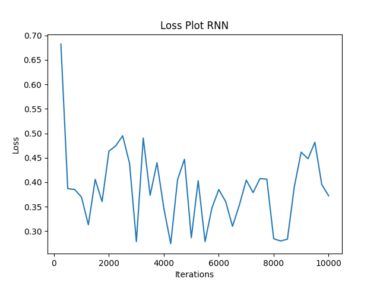 | _*(20/01/2025)*_ Very noisy, but eventually learns. Could benefit from stopping sooner. |
| 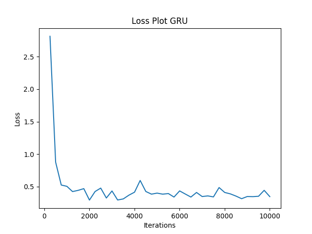 | _*(20/01/2025)*_ Does well can stop it at 2000 iterations. |
| 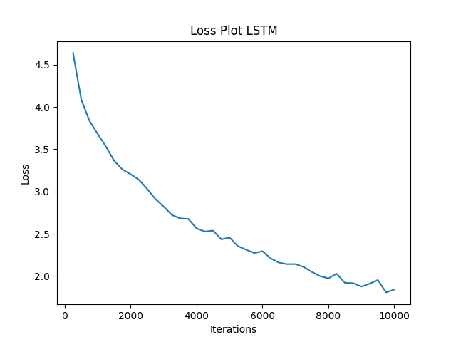 |  _*(20/01/2025)*_ Less noisy, but not tuned well. |

### Models Trained on Code pre AST
- Trained for 15000

| model | inference |
| ---- | ----- |
| 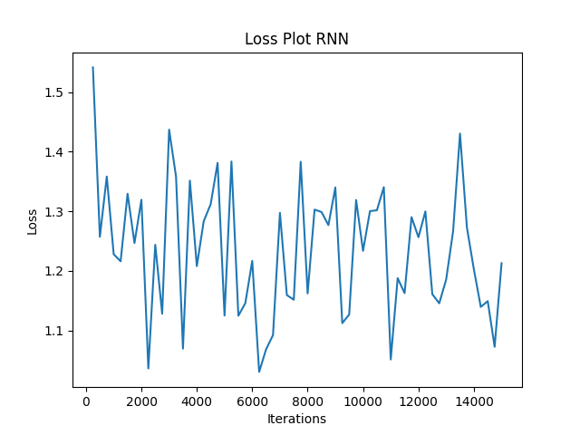| *(17/02/25)* Noisy learning cruve, with large loss, loss has an overall decrease.|
| 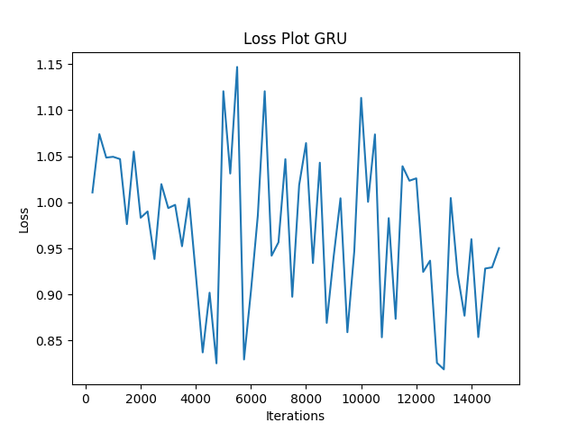 | *(16/02/25)* GRU trained with code data with batch processing enabled, lower error but still noisy. |
| 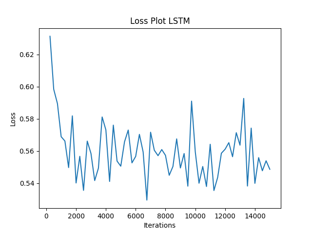| *(17/02/25)* Overall more stable and a small decrease in error.|
| 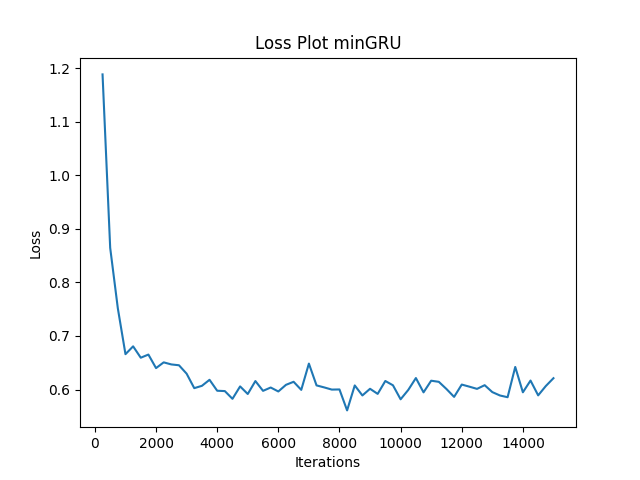 | *(16/02/25)* Mini GRU stable and error drops faster.|
| 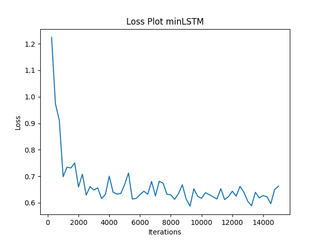 |*(16/02/25)* Mini LSTM less stable than GRU but similar performance acheived. |

### Models Trained on S-Expressions
- Trained for 1500

| model | inference |
| ---- | ----- |
| 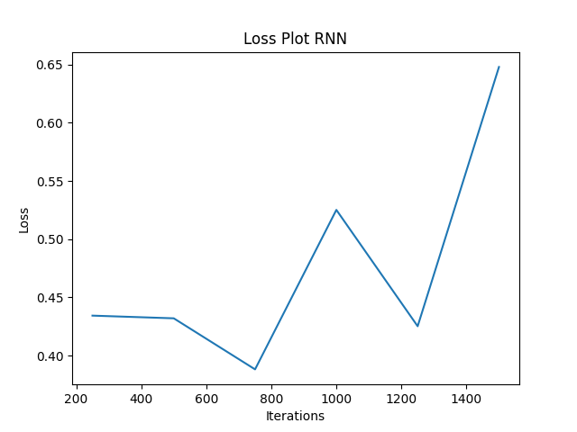 | *(05/03/25)* Lower error value, and less noisy but error jumps back up and wouldn't benefit from early stopping. |
| 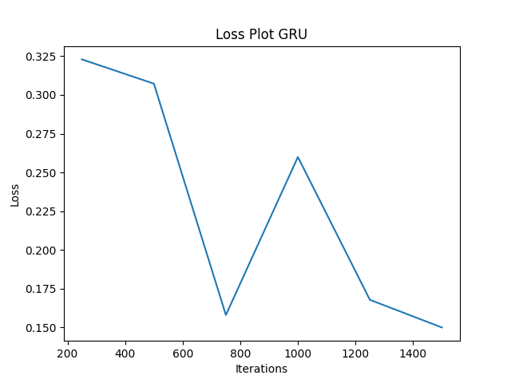| *(05/03/25)* As before similar results to the RNN but overall decrease in error. |
| 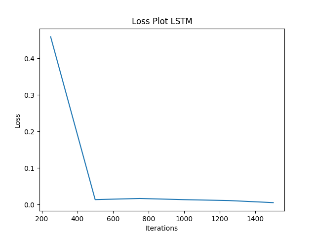| *(05/03/25)* Loss drops quickly and remains stable. |
| 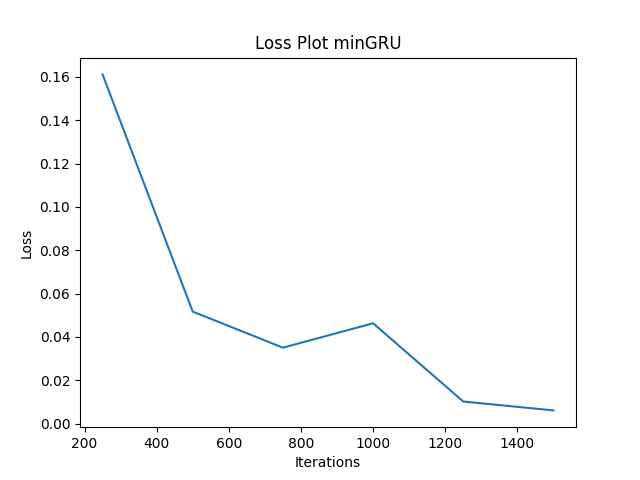 | *(05/03/25)* Achieved a lower error than without AST |
| 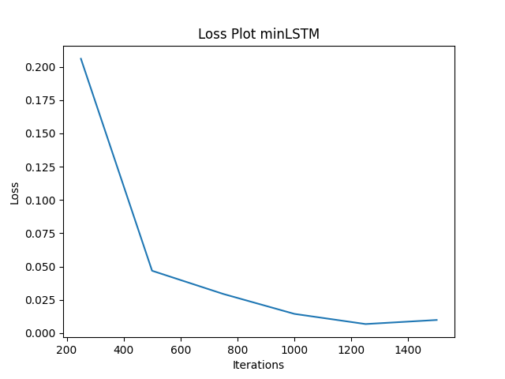 | *(05/03/25)* smoother curve - more stable reaches a lower error|

### Models Trained using Teacher Forcing

| model | inference |
| ---- | ----- |
| 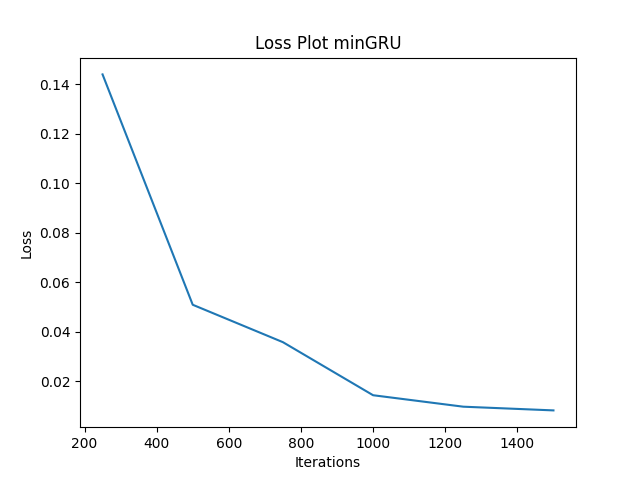 | *(10/03/25)* Lower error (expected), smoother curve. |

### Models Trained using Mixture of Experts
| model | inference |
| ---- | ----- |
| 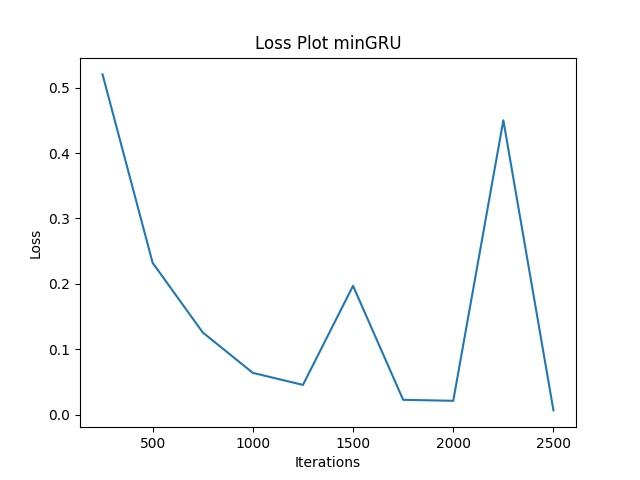 | *(16/03/25)* faster divergence |
